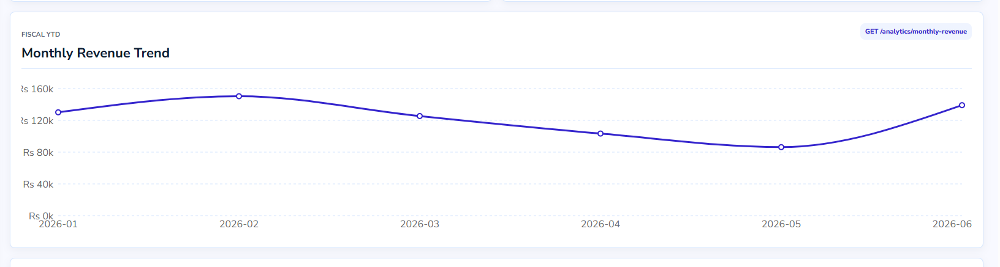
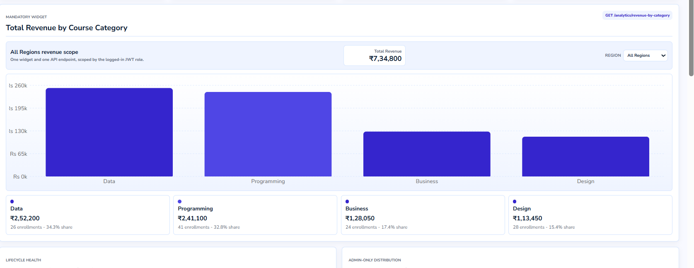
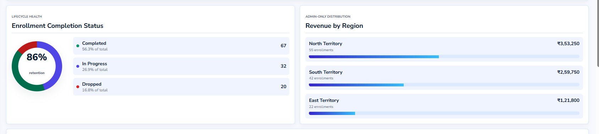
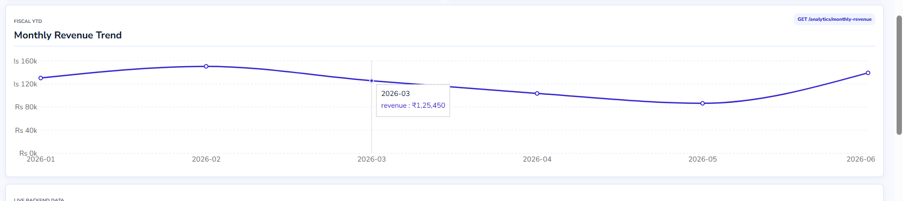
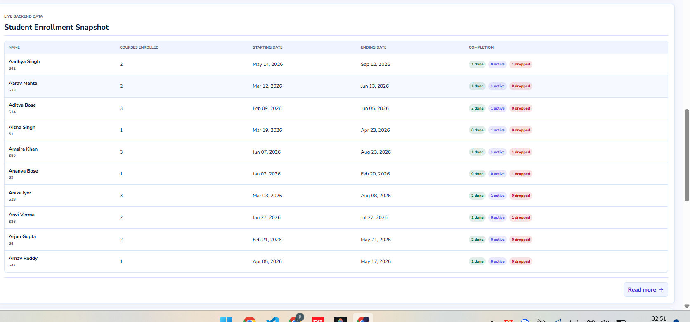
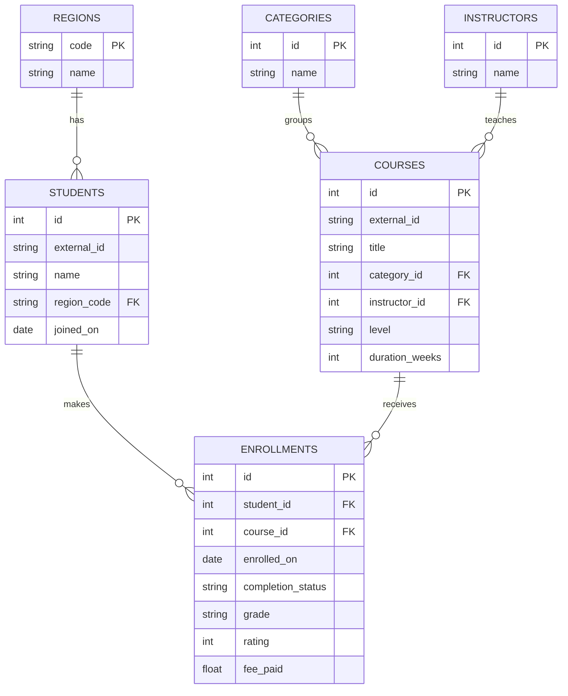
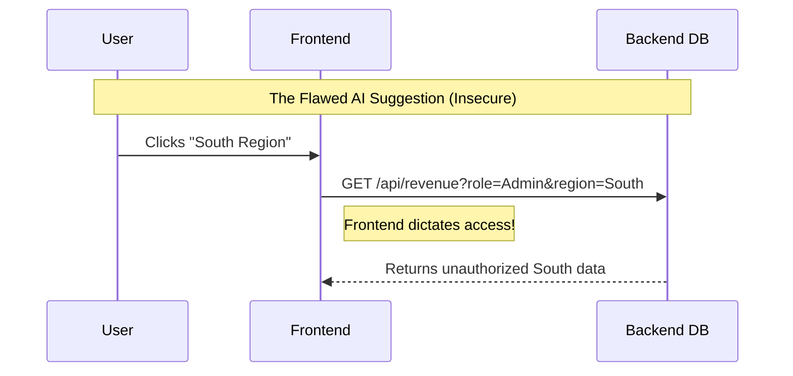
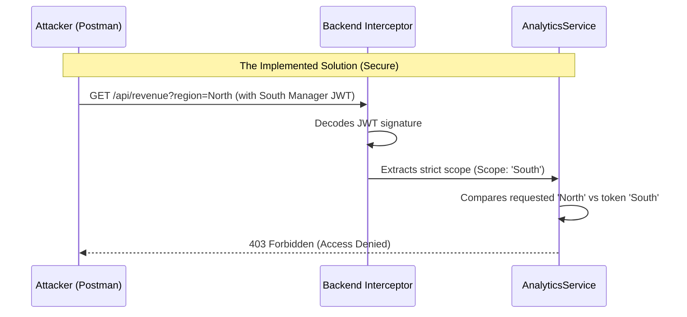

# Role-Based Analytics Dashboard

A full-stack role-based dashboard application built as part of the Neolytix Junior Software Engineer take-home assessment. The application provides secure authentication, robust role-based access control, and dynamic data visualization based on the provided dataset.

---

## Quick Start (Docker)

The entire stack (PostgreSQL, Backend API, Frontend Next.js app) is fully dockerized and configured to automatically run database migrations and seed the data on startup.

1. **Copy the environment variables:**
   ```bash
   cp .env.example .env
   ```
2. **Start the full application stack:**
   ```bash
   docker compose up --build
   ```

* **Frontend UI**: `http://localhost:3000`
* **Backend API**: `http://localhost:3001`
* **Adminer (DB UI)**: `http://localhost:8080`

---

## Screenshots

### Overview Dashboard



### Revenue by Course Category



### Enrollment Completion and Regional Revenue



### Monthly Revenue Trend



### Student Enrollment Snapshot



---

## Features

- **Secure Authentication**: Utilizing JWT for stateless verification.
- **Strict Role-Based Access Control (RBAC)**: Zero-bypass security enforced at the API layer.
- **Mandatory Dashboard Widget**: A dynamic revenue widget served from a single endpoint that automatically scopes to the user's role.
- **Additional Data Insights**:
  - **Drop-off Risk Watchlist**: Highlights courses with high drop rates.
  - **Monthly Revenue Trend**: Time-series visualization of fiscal momentum.
  - **Most Popular Courses**: Paginated ranking of flagship courses.
  - **Student Enrollment Snapshot**: Ground-level view of student progress.
- **Form Validation**: Client-side validation using `react-hook-form` and `zod`.
- **Responsive UI**: Clean, modular React architecture.

---

## Tech Stack

### Frontend
- **Next.js** (React Framework)
- **Recharts** (Data Visualization)
- **React Hook Form & Zod** (Form State & Validation)
- **Lucide React** (Iconography)

### Backend
- **Nest.js** (Node.js Framework)
- **TypeORM** (Object-Relational Mapping)
- **JWT** (Authentication)

### Database & Development
- **PostgreSQL** (Relational Database)
- **Docker & Docker Compose** (Containerization)

---

## Project Structure

```text
role_based_dashboard/
│
├── frontend/
│   ├── app/                 # Next.js App Router (Pages & Layouts)
│   ├── components/          # React Components (Auth, Dashboard, UI)
│   ├── hooks/               # Custom React Hooks (useDashboardData)
│   ├── lib/                 # API client utilities
│   └── types/               # TypeScript Definitions
│
├── backend/
│   ├── src/
│   │   ├── analytics/       # Analytics Module (Controllers, Services)
│   │   ├── auth/            # Authentication & JWT verification
│   │   ├── database/        # TypeORM Entities, Migrations, and Seeds
│   │   └── main.ts          # Server entry point
│   └── docker-entrypoint.sh
│
├── docker-compose.yml       # Full stack orchestration
└── .env.example             # Required configuration template
```

---

## Authentication & Authorization

The application uses JWT-based authentication with strict backend enforcement.

### Authentication Flow
1. User logs in via the frontend.
2. Backend validates credentials and generates a signed JWT containing the user's explicit `scope`.
3. Frontend stores the authentication token.
4. Protected requests include the JWT in the `Authorization: Bearer <token>` header.
5. Backend middleware verifies the token signature.
6. **Role-based Middleware (`RegionScopeService`)** dynamically intercepts the request and enforces the scope (see Key Design Decisions).

### Test Accounts / Roles

| Role | Email | Password | Access Scope |
| :--- | :--- | :--- | :--- |
| **Admin** | `admin@dashboard.test` | `Admin@123` | Full access (All regions) |
| **North Manager** | `north.manager@dashboard.test` | `North@123` | Strictly North region data |
| **South Manager** | `south.manager@dashboard.test` | `South@123` | Strictly South region data |

---

## Database Design

The nested `data.json` was normalized into a clean PostgreSQL relational structure.



- **`fee_paid` Location**: Stored on `enrollments` rather than `courses` because real-world course fees fluctuate (discounts, differing cohorts).
- **`enrollment_facts` view**: Centralizes complex analytics join paths so widgets can query against a unified regional axis without executing massive joins per request.

---

## API Endpoints

### Authentication
| Method | Endpoint | Description | Auth Required |
| :--- | :--- | :--- | :--- |
| `POST` | `/api/v1/auth/email/login` | Login user and receive JWT | No |

### Analytics & Insights
| Method | Endpoint | Description | Auth Required |
| :--- | :--- | :--- | :--- |
| `GET` | `/api/v1/analytics/overview` | High-level summary metrics | Yes |
| `GET` | `/api/v1/analytics/revenue-by-category` | **Mandatory**: Revenue grouped by category | Yes |
| `GET` | `/api/v1/analytics/drop-off-by-course` | High drop-off rate courses | Yes |
| `GET` | `/api/v1/analytics/popular-courses` | Paginated flagship courses | Yes |
| `GET` | `/api/v1/analytics/monthly-revenue` | Time-series revenue data | Yes |
| `GET` | `/api/v1/analytics/students` | Paginated student snapshot | Yes |

*(All Analytics endpoints support an optional `?region=` query parameter. However, Regional Managers attempting to query outside their authorized scope will be met with a `403 Forbidden` response.)*

---

## Security Considerations

- **No Plaintext Passwords**: Passwords are securely hashed.
- **JWT Authentication**: Secure, stateless verification.
- **Protected API Routes**: Endpoints are locked behind JWT verification.
- **Zero-Trust Input**: The backend does *not* trust the frontend's requested region filters. It always verifies against the cryptographically signed JWT.
- **Form Validation**: Client-side protection using Zod schema parsing.

---

## Key Design Decisions

### The Core Requirement: Role-Based Scoping & Revenue Calculation
The absolute most critical aspect of this assessment was ensuring that **revenue calculations and data visibility are strictly scoped to the user's role**, and that this is enforced securely at the API layer.

1. **Strict Role-Based Data Scoping (Zero Bypass):** 
   A non-negotiable requirement of this project is that Regional Managers **must never** access data outside their designated territory. To guarantee this, security is enforced entirely at the backend. The frontend's region filters are strictly cosmetic. If a South Manager manipulates an API request to fetch North region data (e.g., `GET /api/v1/analytics/overview?region=North`), the backend intercepts the request, reads the JWT, identifies the unauthorized scope attempt, and outright rejects it. The API cannot be tricked.

2. **The Mandatory Revenue Widget (One Endpoint):** 
   I built exactly one mandatory widget—a dynamic bar chart visualizing Total Revenue grouped by Course Category. Crucially, this single widget is served by a single backend endpoint (`/api/v1/analytics/revenue-by-category`). It dynamically adapts its SQL query `WHERE` clauses based on the authenticated user's JWT. Admins see aggregated global data, while Managers only see their own territory's revenue.

---

## Assumptions

- Users can only access resources permitted by their role.
- Authentication is strictly required for any dashboard functionality.
- Backend authorization is the absolute source of truth and is enforced independently of frontend UI restrictions.
- Environment-specific configuration is provided through `.env` files (committed intentionally for assessment ease of use).

---

## Working with AI

As an AI-first developer, I utilized AI heavily as a pair-programmer to accelerate boilerplate generation, complex data aggregations, and component refactoring.

### Where AI Accelerated Development
1. **Complex Data Aggregations**: AI helped generate the complex TypeORM migration to build the `enrollment_facts` SQL View, optimizing future widget queries.
2. **Frontend Architecture**: AI was used to systematically refactor a massive monolith `DashboardShell.tsx` component into pure custom hooks (`useDashboardData.ts`) and single-responsibility presentational components.
3. **Form Validation**: Rapidly migrated manual state handling over to `react-hook-form` bound to a strictly typed `zod` schema.

### Where AI Got it Wrong (The Security Flaw)
When prompted to implement the role-based region filtering for the mandatory Revenue Widget, the AI fundamentally misunderstood the security boundary. 

**The AI's Flawed Suggestion:** The AI suggested that the frontend should determine the user's role and pass it as a parameter (e.g., `?role=Manager&region=North`) to the backend, and the backend should simply trust this parameter to filter the SQL query.



**The Catch & Fix:** I caught this immediately. Trusting client-provided role data is a massive security flaw (Broken Access Control) and completely violates the assessment's core requirement. I completely discarded the AI's approach and engineered a secure backend boundary:



Now, the backend securely decrypts the JWT on the server, extracts the verified `scope`, and uses that strict scope to dynamically mutate the TypeORM SQL `WHERE` clauses. If a manager tries to fetch outside their JWT scope, they are instantly rejected.
